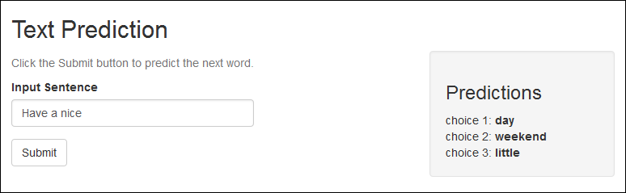

Lightweight Text Prediction App
========================================================
author: Ted Yun

Introduction
========================================================
A light-weight application for predicting the next word given a sentence.

Display three choices.

Algorithm
========================================================
- **N-gram** model - We use contiguous sequencs of n words in a sentence.
- Predict the next word based on the previous n words that appeared in the text.
- Built 5, 4, 3, 2, and 1-gram dictionaries from our vast dataset.
- **Back-off** model - We start with 5-gram dictionary, "back-off" to smaller n-grams under certain conditions.

Data
========================================================
- Trained with a vast amount of data from blogs, news, and twitter.
- **Blog** - 899 thousand texts, 42 words each.
- **News** - 77 thousand texts, 35 words each.
- **Twitter** - 2.3 million texts, 13 words each.

Data
========================================================
- Trained with a vast amount of data from blogs, news, and twitter.
- **Blog** - 899 thousand texts, 42 words each.
- **News** - 77 thousand texts, 35 words each.
- **Twitter** - 2.3 million texts, 13 words each.

